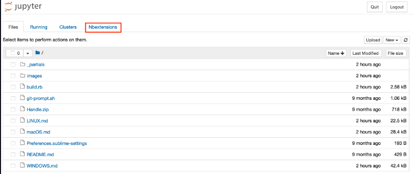
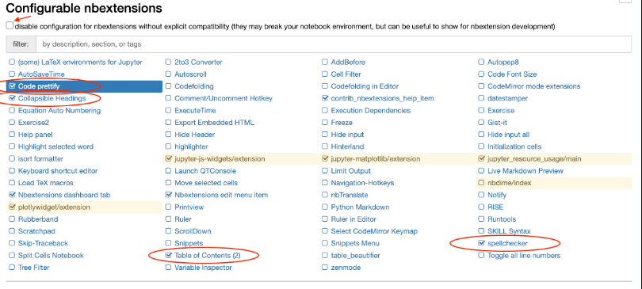
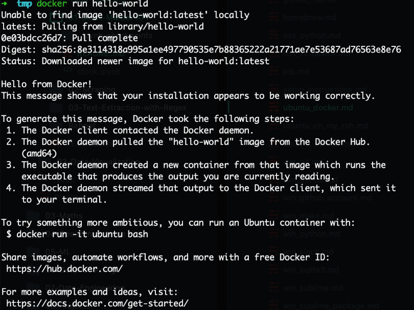

# Setup instructions

You will find below the instructions to set up your computer.

Let's start:

## Email, oddo and trello
You will need to ask to some buddies to get your news accounts:
- G Suite of Google: Sistemes Team
- Oddo: Erp Team
- Trello: any IT buddy

## GitHub account

If you haven't signed up to GitHub [do it right away](https://github.com/join).

:point_right: **[Upload a picture](https://github.com/settings/profile)** and put your name correctly on your GitHub account. This is important as we'll use an internal dashboard with your avatar. 

If you already had an account, add your somenergia email to your github account.

Now, ask some IT buddy to join you in the [Somenergia Team](https://github.com/Som-Energia/) and Gisce Team.

## GitLab account

To get a [Som Energia GitLab](https://gitlab.somenergia.coop/) account, ask to Sistemes Team. They will create it for you. 

A VPN active connection to the Som Energia local network is needed to access to GitLab.


## VPN
Ask to the Helpdesk Team to setup your connection to the Som Energia local network.

## Visual Studio Code

### Installation

Let's install [Visual Studio Code](https://code.visualstudio.com) text editor.

Copy (`Ctrl` + `C`) the commands below then paste them in your terminal (`Ctrl` + `Shift` + `v`):

```bash
wget -qO- https://packages.microsoft.com/keys/microsoft.asc | gpg --dearmor > packages.microsoft.gpg
sudo install -o root -g root -m 644 packages.microsoft.gpg /etc/apt/trusted.gpg.d/
sudo sh -c 'echo "deb [arch=amd64,arm64,armhf signed-by=/etc/apt/trusted.gpg.d/packages.microsoft.gpg] https://packages.microsoft.com/repos/code stable main" > /etc/apt/sources.list.d/vscode.list'
rm -f packages.microsoft.gpg
sudo apt update
sudo apt install -y code
```

These commands will ask for your password: type it in.

### Launching from the terminal

Now let's launch VS Code from **the terminal**:

```bash
code
```

:heavy_check_mark: If a VS Code window has just opened, you're good to go :+1:

### VS Code Extensions

Let's install some useful extensions to VS Code.

```bash
code --install-extension ms-vscode.sublime-keybindings
code --install-extension emmanuelbeziat.vscode-great-icons
code --install-extension MS-vsliveshare.vsliveshare
code --install-extension ms-python.python
code --install-extension KevinRose.vsc-python-indent
code --install-extension ms-python.vscode-pylance
code --install-extension ms-toolsai.jupyter
```

Here is a list of the extensions you are installing:
- [Sublime Text Keymap and Settings Importer](https://marketplace.visualstudio.com/items?itemName=ms-vscode.sublime-keybindings)
- [VSCode Great Icons](https://marketplace.visualstudio.com/items?itemName=emmanuelbeziat.vscode-great-icons)
- [Live Share](https://marketplace.visualstudio.com/items?itemName=MS-vsliveshare.vsliveshare)
- [Python](https://marketplace.visualstudio.com/items?itemName=ms-python.python)
- [Python Indent](https://marketplace.visualstudio.com/items?itemName=KevinRose.vsc-python-indent)
- [Pylance](https://marketplace.visualstudio.com/items?itemName=ms-python.vscode-pylance)
- [Jupyter](https://marketplace.visualstudio.com/items?itemName=ms-toolsai.jupyter)


### Live Share configuration

[Visual Studio Live Share](https://visualstudio.microsoft.com/services/live-share/) is a VS Code extension which allows you to share the code in your text editor for debugging and pair-programming: let's set it up!

Launch VS Code from your terminal by typing `code` and pressing `Enter`.

Click on the little arrow at the bottom of the left bar :point_down:


- Click on the "Share" button, then on "GitHub (Sign in using GitHub account)".
- A popup appears asking you to sign in with GitHub: click on "Allow".
- You are redirected to a GitHub page in you browser asking you to authorize Visual Studio Code: click on "Continue" then "Authorize github".
- VS Code may display additional pop-ups: close them by clicking "OK".

That's it, you're good to go!

## Command line tools

### Zsh & Git

Instead of using the default `bash` [shell](https://en.wikipedia.org/wiki/Shell_(computing)), I will use `zsh`.

We will also use [`git`](https://git-scm.com/), a command line software used for version control.

Let's install them, along with other useful tools:
- Open an **Ubuntu terminal**
- Copy and paste the following commands:

```bash
sudo apt update
sudo apt install -y curl git imagemagick jq unzip vim zsh
```
Also add some useful basis tools:

```bash
sudo apt install vim tig htop net-tools build-essential mlocate
```

These commands will ask for your password: type it in.


### GitHub CLI installation

Let's now install [GitHub official CLI](https://cli.github.com) (Command Line Interface). It's a software used to interact with your GitHub account via the command line.

In your terminal, copy-paste the following commands and type in your password if asked:

```bash
curl -fsSL https://cli.github.com/packages/githubcli-archive-keyring.gpg | sudo dd of=/usr/share/keyrings/githubcli-archive-keyring.gpg
echo "deb [arch=$(dpkg --print-architecture) signed-by=/usr/share/keyrings/githubcli-archive-keyring.gpg] https://cli.github.com/packages stable main" | sudo tee /etc/apt/sources.list.d/github-cli.list > /dev/null
sudo apt update
sudo apt install -y gh
```

To check that `gh` has been successfully installed on your machine, you can run:

```bash
gh --version
```

:heavy_check_mark: If you see `gh version X.Y.Z (YYYY-MM-DD)`, you're good to go :+1:


## Oh-my-zsh

Let's install the `zsh` plugin [Oh My Zsh](https://ohmyz.sh/).

In a terminal execute the following command:

```bash
sh -c "$(curl -fsSL https://raw.github.com/ohmyzsh/ohmyzsh/master/tools/install.sh)"
```

If asked "Do you want to change your default shell to zsh?", press `Y`

At the end your terminal should look like this:


:heavy_check_mark: If it does, you can continue :+1:


## GitHub CLI

CLI is the acronym of [Command-line Interface](https://en.wikipedia.org/wiki/Command-line_interface).

In this section, we will use [GitHub CLI](https://cli.github.com/) to interact with GitHub directly from the terminal.

It should already be installed on your computer from the previous commands.

First in order to **login**, copy-paste the following command in your terminal:

:warning: **DO NOT edit the `email`**

```bash
gh auth login -s 'user:email' -w
```

gh will ask you few questions:

`What is your preferred protocol for Git operations?` With the arrows, choose `SSH` and press `Enter`. SSH is a protocol to log in using SSH keys instead of the well known username/password pair.

`Generate a new SSH key to add to your GitHub account?` Press `Enter` to ask gh to generate the SSH keys for you.

If you already have SSH keys, you will see instead `Upload your SSH public key to your GitHub account?` With the arrows, select your public key file path and press `Enter`.

`Enter a passphrase for your new SSH key (Optional)`. Type something you want and that you'll remember. It's a password to protect your private key stored on your hard drive. Then press `Enter`.

:warning: When you type your passphrase, nothing will show up on the screen, **that's normal**. This is a security feature to mask not only your passphrase as a whole but also its length. Just type your passphrase and when you're done, press `Enter`.

You will then get the following output:

```bash
! First copy your one-time code: 0EF9-D015
- Press Enter to open github.com in your browser...
```

Select and copy the code (`0EF9-D015` in the example), then press `Enter`.

Your browser will open and ask you to authorize GitHub CLI to use your GitHub account. Accept and wait a bit.

Come back to the terminal, press `Enter` again, and that's it.

To check that you are properly connected, type:

```bash
gh auth status
```

:heavy_check_mark: If you get `Logged in to github.com as <YOUR USERNAME> `, then all good :+1:

Now, we need to say Github who is working in a current project. This is important because Git commits use this information, and it is immutably entered into the commits you submit. Let go to set your username and email address:

```bash
git config --global user.name "Lugadur"
git config --global user.email lucia.garcia@somenergia.coop
```
If you want to overwrite this information with another name or email address for specific projects, you can run the command without the --global option when you are in that project.

If you want to check your configuration:

```bash
git config --list
```

## Disable SSH passphrase prompt

You don't want to be asked for your passphrase every time you communicate with a distant repository. So, you need to add the plugin `ssh-agent` to `oh my zsh`:

First, open the `.zshrc` file:

```bash
code ~/.zshrc
```

Then:
- Spot the line starting with `plugins=`
- Add `ssh-agent` at the end of the plugins list

The list should look like:

```bash
plugins=(gitfast last-working-dir common-aliases zsh-syntax-highlighting history-substring-search pyenv ssh-agent)
```

:heavy_check_mark: Save the `.zshrc` file with `Ctrl` + `S` and close your text editor.

## Linphone

We use linphone to call by phone over the internet. 

```bash
sudo apt install linphone
```
To setup the conexion, you need to check the [Linphone Documentation](https://docs.google.com/document/d/1f-_6cpY-3wr_7HJhDkUUejrWPQo-9edy2seM0nzg-W4/edit). 

A VPN active conexion to the Som Energia local network is needed to use this service.

## Installing Python (with [`pyenv`](https://github.com/pyenv/pyenv))

Ubuntu comes with an outdated version of Python that we don't want to use. We are going to do a professional setup of Python where you'll be able to switch which version you want to use whenever you type `python` in the terminal.

First let's install `pyenv` with the following Terminal command:

```bash
git clone https://github.com/pyenv/pyenv.git ~/.pyenv
exec zsh
```

Ignore the `pyenv: no such command 'virtualenv-init' for now`.

Let's install some [dependencies](https://github.com/pyenv/pyenv/wiki/common-build-problems#prerequisites) needed to build Python from `pyenv`:

```bash
sudo apt-get update; sudo apt-get install make build-essential libssl-dev zlib1g-dev \
libbz2-dev libreadline-dev libsqlite3-dev wget curl llvm \
libncursesw5-dev xz-utils tk-dev libxml2-dev libxmlsec1-dev libffi-dev liblzma-dev \
python-dev python3-dev
```

Let's install the [latest stable version of Python](https://www.python.org/doc/versions/):

```bash
pyenv install 3.8.12
```

This command might take a while, this is perfectly normal. 

OK once this command is complete, we are going to tell the system to use this version of Python **by default**. If we don't do this step, provably Ubuntu is going to use an older version, although we have installed a newer one. This is done with:

```bash
pyenv global 3.8.12
exec zsh
```

To check if this worked, run `python --version`. If you see `3.8.12`, perfect! If not, you could debug the problem thanks to `pyenv versions` and `type -a python` (`python` should be using the `.pyenv/shims` version first).


## Python Virtual Environment

Before we start installing relevant Python packages, we will isolate the setup for a project into a **dedicated** virtual environment. We will use a `pyenv` plugin called [`pyenv-virtualenv`](https://github.com/pyenv/pyenv-virtualenv).

First let's install this plugin:

```bash
git clone https://github.com/pyenv/pyenv-virtualenv.git $(pyenv root)/plugins/pyenv-virtualenv
exec zsh
```

Let's create the virtual environment we are going to use during the project:

```bash
pyenv virtualenv 3.8.12 somenergia
```

Let's now set the virtual environment with:

```bash
pyenv global somenergia
```

Great! Anytime we'll install Python package, we'll do it in that environment.

To create a virtualenv for a specific project, you just must create the enviroment, create a folder and assign the enviroment to the folder. First:

```bash
pyenv virtualenv 3.8.12 somproject1
mkdir somproject1
cd somproject1
vi .python-version
```
Second: Add the name of the enviroment to the hidden file .python-version of the folder.


## Python packages

Now that we have a pristine `somproject1` virtual environment, it's time to install some packages in it.

First, let's upgrade `pip`, the tool to install Python Packages from [pypi.org](https://pypi.org). In the latest terminal where the virtualenv `somproject1` is activated, run:

```bash
pip install --upgrade pip
```

Then let's install some packages for the first weeks of the program:

``` bash
pip install -r https://raw.githubusercontent.com/lewagon/data-setup/master/specs/releases/linux.txt
```


## `jupyter` notebook extensions

Pimp your `jupyter` notebooks with awesome extensions:

```bash
# install nbextensions
jupyter contrib nbextension install --user
jupyter nbextension enable toc2/main
jupyter nbextension enable collapsible_headings/main
jupyter nbextension enable spellchecker/main
jupyter nbextension enable code_prettify/code_prettify
```

### Custom CSS

Improve the display of the [`details` disclosure elements](https://developer.mozilla.org/en-US/docs/Web/HTML/Element/details) in your notebooks.

Open `custom/custom.css` in the config directory:
```bash
cd $(jupyter --config-dir)
mkdir -p custom
touch custom/custom.css
code custom/custom.css
```
Edit `custom.css` with:

```css
summary {
    cursor: pointer;
    display:list-item;
}
summary::marker {
    font-size: 1em;
}
```

You can close VS Code.

### `jupyter` check up

Let's reset your terminal:

```bash
exec zsh
```

Now, check you can launch a notebook server on your machine:

```bash
jupyter notebook
```

Your web browser should open on a `jupyter` window now.

### `nbextensions` check up

Perform a sanity check for `jupyter notebooks nbextensions`. Click on `Nbextensions`:



Untick _"disable configuration for nbextensions without explicit compatibility"_ then check that _at least_ all `nbextensions` circled in red are enabled:



You can close your web browser then terminate the jupyter server with `CTRL` + `C`.


### Python setup check up

Check your Python version with the following commands:
```bash
zsh -c "$(curl -fsSL https://raw.githubusercontent.com/lewagon/data-setup/master/checks/python_checker.sh)" 3.8.12
```

Run the following command to check if you successfully installed the required packages:
```bash
zsh -c "$(curl -fsSL https://raw.githubusercontent.com/lewagon/data-setup/master/checks/pip_check.sh)"
```

Now run the following command to check if you can load these packages:
```bash
python -c "$(curl -fsSL https://raw.githubusercontent.com/lewagon/data-setup/master/checks/pip_check.py)"
```

Make sure you can run Jupyter:

```bash
jupyter notebook
```

And open a `Python 3` notebook.

Make sure that you are running the correct python version in the notebook. Open a cell and run :
``` python
import sys; sys.version
```

Here you have it! A complete python virtual env with all the third-party packages you'll need for the whole bootcamp.

## Docker 🐋

Docker is an open platform for developing, shipping, and running applications.

_if you already have Docker installed on your machine please update with the latest version_

### Install Docker

Go to [Docker install documentation](https://docs.docker.com/engine/install/ubuntu/#install-using-the-repository).

Then follow the tutorial instructions to install Docker **using the repository**. There are 2 steps:

- SET UP THE REPOSITORY
- INSTALL DOCKER ENGINE

Once done, you should be able to run:

```bash
sudo service docker start
```

```bash
sudo docker run hello-world
```

The following message should print:



```bash
sudo service docker stop
```

## ERP Client

You have at your disposal the [ERP documentation](https://gitlab.somenergia.coop/IT/it-docs/-/wikis/ERPClient) in GitLab. In case you need support, contact with the Helpdesk Team.

Open a terminal and run:

```bash
sudo apt -y install apt-transport-https ca-certificates curl software-properties-common
curl -fsSL https://download.docker.com/linux/ubuntu/gpg | sudo apt-key add -
sudo add-apt-repository "deb [arch=amd64] https://download.docker.com/linux/ubuntu focal stable" -y
sudo apt update -y
sudo apt-cache policy docker-ce
sudo apt install docker-ce -y
#sudo usermod -aG docker somenergia
sudo usermod -aG docker "el vostre ususari"
systemctl status docker
sudo systemctl status docker
```
:warning: You need to replace the user name with your user.

Restart the computer and, as a user without permissions that we want to run the erp client, run the script:
```bash
../erpclientIT/reconfigure_dockerfile.sh
```
From within the folder:

```bash
docker build -t erpclientit
```
Now, to open the ERP client open the file ../erpclientIT/erpclient.sh

If you want to create an app desktop icon in your computer you must create a folder:

```bash
sudo vim /usr/share/applications/erp.desktop
```
and include inside the following content:
```bash
Name=ERP
Comment=Comentario sobre el programa
Exec=/home/joana/somenergia/erpclient/launcher_erp.sh
Icon=/home/joana/somenergia/erpclient/bin/pixmaps/openerp-icon.png
Terminal=false
Type=Application
```
Restart nautilus: 
```bash
nautilus -q
```

## Postgresql (infinished)

```bash
sudo apt install -y postgresql postgresql-contrib postgresql-client
```

## PgAdmin (infinished)

[Download documentation](https://www.pgadmin.org/download/pgadmin-4-apt/)


## Password management

We encourage you to use a secure password manager app.

There are difference options: [Keepass](https://keepassxc.org/download/) is a app for your computer which run in local. If you will use multiple devices you could use[Bitwarden](https://bitwarden.com/help/cli/) which is online and provide a computer app, mobile app and browser extension to access to your credentials.